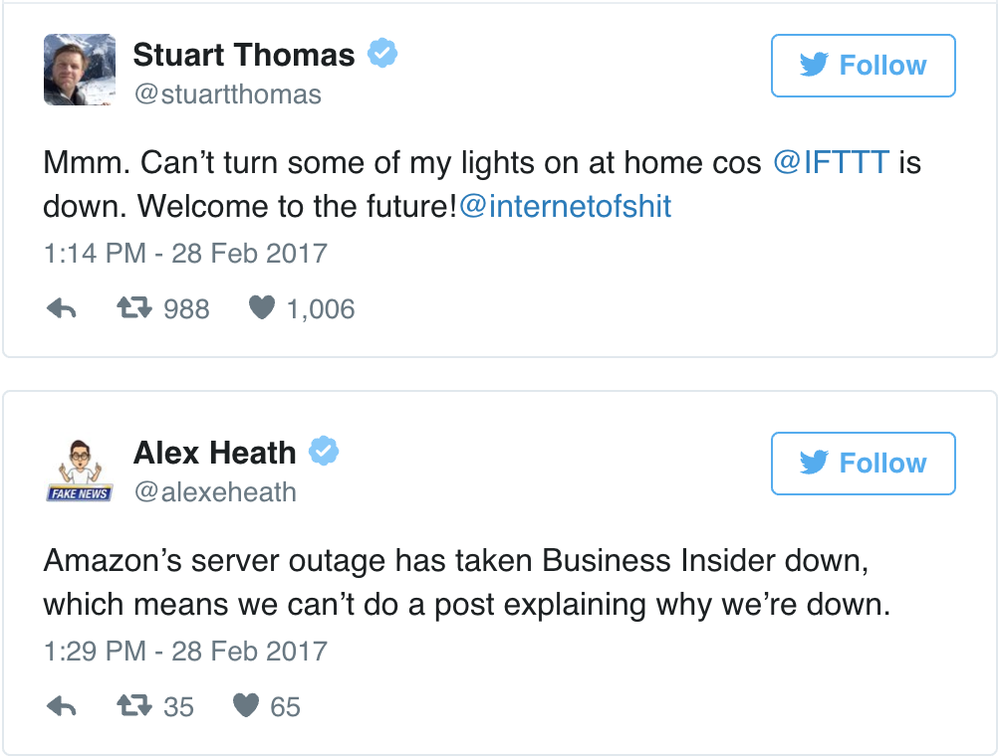
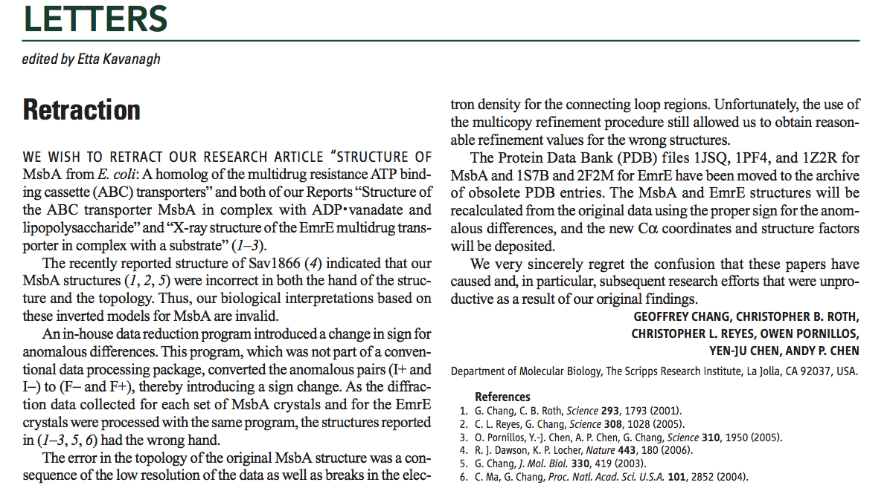
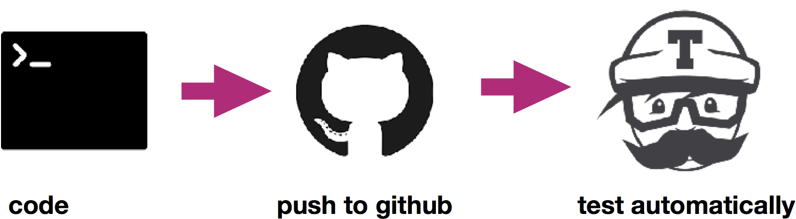

name: inverse
layout: true
class: center, middle, inverse
---
# Writing unit and regression tests

---
layout: false
##<span style="color:purple">Outline</span>

- ### Learning objectives
- ### Requirements
- ### Introduction
- ### Exercises
- ### Testing tools

---
name: inverse
layout: true
class: center, middle, inverse
---
## Learning objectives
---
layout: false

- Why do we write tests?

- What are the various types of software tests?

- How to write simple unit and regression tests?

- What are the testing frameworks in Python?

- What is Continuos Integration?


---
name: inverse
layout: true
class: center, middle, inverse
---
## Introduction
---
layout: false

### <span style="color:purple"> Why do we test software?</span>

--

- #### mistakes happen and always will

---
### <span style="color:purple"> Why do we test software?</span>


--




---
### <span style="color:purple"> Why do we test software?</span>


--

- It started harmlessly:

  - *A team member was doing a bit of maintenance on Amazon Web Services Tuesday...*

--

  - *With a few mistaken keystrokes, ...*

--

  - *... The cascading failure meant that many websites could no longer make changes to the information stored on Amazon's cloud platform....*

--
- Amazon said: *We have modified this tool to remove capacity more slowly and **added safeguards to prevent** capacity from being removed when it will take any subsystem below its minimum required capacity level.*

--

**Including tests is one of the possible safeguards when writing software!**

---
### <span style="color:purple"> Why do we test software?</span>

#### And now a scientist's nightmare...

--

- A Prof. Geoffrey Chang story who had to retract 5 articles (3 from *Science*, *PNAS*, *J.Mol.Biol.*)

&nbsp;



&nbsp;

- *An in-house data reduction program introduced a change in sign...*

---
### <span style="color:purple"> Why do we test software?</span>


- makes you think about desirable output

- improves readability of your code

&nbsp;


---
###<span style="color:purple">Various types of tests</span>

--

- Unit tests

  - work on isolated parts (units) of the program
  - verify that units operate correctly in various scenarios
  - usually compare observed results to well known expected results


- Integration tests

  - combine individual software modules and test as a group
  - similar structure as unit tests: compare observed results to  expected results, but the expected result can be more complicated to represent

&nbsp;

--

- Regression tests

  - verify that software previously developed and tested still performs correctly even after it was changed or interfaced with other software

  - you don't have to knows the expected result, the assumption is that the past results were correct.

---

### <span style="color:purple">Science and software testing</span>

- We all question/test many things in our scientific work

- When writing a program we often execute a simple example first and check the output

&nbsp;

--

- Writing software tests for your scientific code is:

  - translating your ideas for verification to programming code

  - automating the process of verification, so you can do it on a regular basis

---
name: inverse
layout: true
class: center, middle, inverse
---
## Setup
---
layout: false

#### Python environment and text editor

If you haven't prepare your environment, you can still do it:

- Install conda: [follow instructions](https://conda.io/projects/conda/en/latest/user-guide/install/index.html)

- creating an environment:
```bash
$ conda create --name pycon numpy scipy matplotlib pytest hyphothesis
```

--

Checking if you have library
```bash
$ python --version
Python 3.7.3
```

```bash
$ python -c "import matplotlib; print(matplotlib.__version__)"
3.0.3
```

--

- you should have your favourite text editor, if you don't, please install jupyter, eg.:

```bash
$ conda install jupyter
```

---

name: inverse
layout: true
class: center, middle, inverse
---
## Exercises
---
layout: false
TODO
#### All notebooks with solutions to the following exercises can be found in the [repository](https://github.com/nipy/workshops/tree/master/170327-nipype/notebooks/testing/solutions)

---
### <span style="color:purple">Assert statement</span>

&nbsp;

```bash
assert Expression[, Arguments]
```
- Python evaluates the Expression to either True or False

- if the Expression is false, `assert` returns an `AssertionError`


- TODO: a rendered version of a notebook with examples can be found  [here](http://nbviewer.jupyter.org/github/nipy/workshops/blob/master/170327-nipype/notebooks/testing/solutions/asserts.ipynb)
---
### <span style="color:purple">Assert statement</span>

- Examples:
  ```python
  assert True
  ```
  ```python
  assert False
  ```
  ```python
  assert 1 + 2 == 3
  ```
  ```python
  assert 2**0.5 < 1.5
  ```
  ```python
  assert 2 != 3
  ```

  ```python
  assert type(2) is int
  ```
  ```python
  assert 2 in [1,2,3]
  ```
  ```python
  assert 2 not in [1,2,3]
  ```

---
name: inverse
layout: true
class: center, middle, inverse
---
## Testing tools
---
layout: false

### <span style="color:purple">Python testing frameworks</span>

- unittest

- nosetests

- pytest


&nbsp;

--

Which framework should you use?

- A great comparison of the frameworks you can find [here](http://pythontesting.net/start-here/)

- A short answer: **use pytest if you can**


---
### <span style="color:purple">Unit tests with Pytest library</span>


- it’s easy to get started

- straightforward asserting with the assert statement

  ```python
  def my_factorial(n):
      if n == 1 or n == 0:
          return 1
      else:
          return n * my_factorial(n-1)

  def test_factorial_1():
      assert my_factorial(1) == 1

  def test_factorial_2():
      assert my_factorial(5) == 120
  ```

- helpful traceback and failing assertion reporting

- automatic test discovery

  ```bash
  # discovers all tests in all subdirectories
  pytest
  # runs all test from test_random.py file only
  pytest tests_factorial.py
  # runs one specific test
  pytest tests_factorial.py::test_factorial_1
  ```

- many useful features including fixtures, test parametrization, etc., 
that will be covered during the tutorial

---
### <span style="color:purple">Unit tests with Pytest library</span>

#### Additional options to pytest command 

TODO
- try a `-v` option
  ```bash
  pytest -v
  ```
--
Full list of option:

- `-h` (`--help`) option
  ```bash
  pytest -h
  ```


---
### <span style="color:purple">Unit tests with Pytest library</span>


#### TODO: Use pytest features to rewrite your tests sets

- read about [parametrization](https://docs.pytest.org/en/latest/parametrize.html) and try to use it within your test functions

- read about [skip/xfail](https://docs.pytest.org/en/latest/skipping.html) and
 and [exceptions check](https://docs.pytest.org/en/latest/assert.html#assertions-about-expected-exceptions), try to use it in your existing tests and write new tests

- check if your functions still pass all tests

- if your tests fail rewrite the function or at least use `pytest.mark.xfail`  and provide the `reason`

--

&nbsp;

- an exemplary directory with all functions and tests can be found [here](https://github.com/nipy/workshops/tree/master/170327-nipype/notebooks/testing/pytest_mark_solutions)

---
### <span style="color:purple">Automate testing </span>

  - Pros:
      - Build and check the code every time you (and others) change it
      - Get immediate feedback
      - Easily integrate testing into your work flow
      &nbsp;
      - Use various environments for testing the code

  &nbsp;

  - Continuous Integration Services

      - [Travis CI][https://travis-ci.org/]
      - [CircleCI][https://circleci.com/]
      - ...

                                       


---
### <span style="color:purple">Automate testing: Integrate Travis CI with GitHub </span>

- Todo

---
### TODO<span style="color:purple">External resources</span>

- [Software Carpentry](http://katyhuff.github.io/python-testing/index.html)

- [Nice presentation with hands-on examples](https://github.com/ASPP/testing_debugging_profiling)

---

### TODO<span style="color:purple">Acknowledgements</span>

- PSF
- MIT, ReproNim
-Caltech
---


name: inverse
layout: true
class: center, middle, inverse
---
# Questions?
